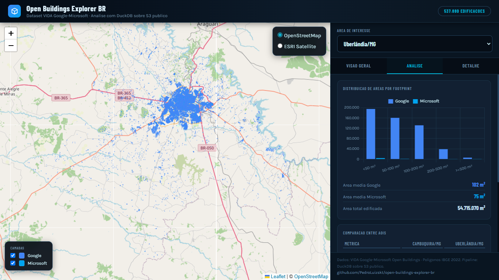
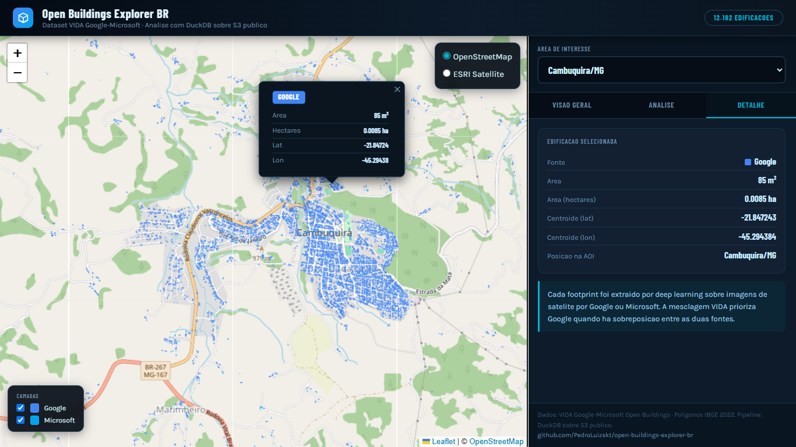

# open-buildings-explorer-br

> **Análise geoespacial em escala de bilhões de linhas com DuckDB sobre o dataset Google-Microsoft Open Buildings, com webmap comparativo Google × Microsoft para cidades brasileiras.**

[](https://opensource.org/licenses/MIT)
[](https://www.python.org/downloads/)
[](https://duckdb.org/)
[](https://leafletjs.com/)
[](#testes)
[](CHANGELOG.md)

Pipeline Python que consulta o **[Google-Microsoft Open Buildings](https://beta.source.coop/repositories/vida/google-microsoft-open-buildings/description/)** — 2.534.595.270 edificações globais, 141 milhões no Brasil — diretamente de bucket S3 público via **DuckDB** com extensões `httpfs` e `spatial`. Produz **webmap HTML interativo multi-AOI** com dashboard comparativo Google × Microsoft, servido via GitHub Pages sem backend.

**Áreas de interesse iniciais**: Cambuquira/MG (município rural, 246 km²) e Uberlândia/MG (cidade média, 4.115 km²), ambas com polígonos oficiais da malha municipal IBGE 2022.

---

## Sumário

1. [Resultados](#1-resultados)
2. [Webmap ao vivo](#2-webmap-ao-vivo)
3. [Por que DuckDB](#3-por-que-duckdb)
4. [Instalação](#4-instalação)
5. [Uso rápido](#5-uso-rápido)
6. [Interface de linha de comando](#6-interface-de-linha-de-comando)
7. [Gerenciamento de disco](#7-gerenciamento-de-disco)
8. [GitHub Pages](#8-github-pages)
9. [Estrutura do repositório](#9-estrutura-do-repositório)
10. [Testes](#10-testes)
11. [Decisões arquiteturais (ADRs)](#11-decisões-arquiteturais-adrs)
12. [Como citar](#12-como-citar)
13. [Licença](#13-licença)
14. [Autor](#14-autor)

---

## 1. Resultados

Pipeline completo rodando em ambiente real (Windows, Python 3.12.3), DuckDB persistente em disco, polígonos oficiais IBGE 2022:

| Área de interesse | Área oficial | Edificações | Google | Microsoft | Densidade |
|-------------------|-------------:|------------:|-------:|----------:|----------:|
| Cambuquira/MG     | 246,38 km²   | 12.182      | 11.298 (92,7%) | 884 (7,3%)    | 49 edif/km² |
| Uberlândia/MG     | 4.115,21 km² | 537.880     | — (ver webmap) | — (ver webmap)| 131 edif/km² |

**Insight principal**: Uberlândia tem **44× mais edificações** que Cambuquira em apenas **17× mais área**, resultando em densidade **2,7× maior** por km² — compatível com urbanização consolidada versus padrão rural.

**Área média por edificação (Cambuquira/MG)**:
- Google: 96,8 m² (casas residenciais médias)
- Microsoft: 57,6 m² (anexos menores, galpões rurais)

A Microsoft parece capturar estruturas pequenas que o Google frequentemente não detecta — diferença metodológica entre os dois pipelines de deep learning.

## 2. Webmap ao vivo



Após deploy via GitHub Pages (seção 8), o webmap fica disponível em:
**https://pedroluizskt.github.io/open-buildings-explorer-br/**

Características:
- **Seletor dropdown** no painel para alternar entre AOIs sem recarregar
- **Painel lateral com três tabs**:
  - **Visão Geral**: metadata IBGE + KPI grid 2×2 + donut Google × Microsoft + narrativa
  - **Análise**: histograma de distribuição de áreas por bucket + tabela comparativa entre AOIs
  - **Detalhe**: info do footprint clicado (fonte, área m², hectares, coordenadas)
- **Popups ricos** ao clicar em qualquer edificação
- **Toggles de camada** Google/Microsoft na legenda flutuante
- **Design**: fontes Barlow Condensed + Karla, paleta dark, Chart.js
- **Autocontido**: Leaflet + Chart.js via CDN, GeoJSONs em `webmap/data/`



## 3. Por que DuckDB

Antes do DuckDB, análise geoespacial sobre datasets desse porte exigia:
- Infraestrutura Spark/PostGIS em cluster (custo e complexidade operacional alta)
- Ou baixar tudo localmente (dezenas de GB de disco, processamento lento)

DuckDB muda a equação:
- **In-process analytics** — biblioteca embutida no Python, sem servidor
- **Vetorização automática** com SIMD e paralelismo por padrão
- **Leitura direta de Parquet em S3** via extensão `httpfs`, com predicate pushdown
- **SQL espacial completo** via extensão `spatial` (compatível com PostGIS)
- **Zero configuração** — `pip install duckdb` e pronto

Uma query comparando cobertura Google vs Microsoft em uma AOI brasileira, sobre 141 milhões de footprints do Brasil, executa em segundos na máquina local sem baixar o dataset inteiro.

## 4. Instalação

**Pré-requisitos**: Python 3.11+.

### Windows (PowerShell)

```powershell
git clone https://github.com/PedroLuizskt/open-buildings-explorer-br.git
cd open-buildings-explorer-br
.\tasks.ps1 setup
```

### Unix/Mac

```bash
git clone https://github.com/PedroLuizskt/open-buildings-explorer-br.git
cd open-buildings-explorer-br
make setup
```

Ambos criam `.venv/`, instalam o pacote em modo editável com extras `dev` + `notebook`, e rodam a suíte inicial.

## 5. Uso rápido

**Primeira execução** — baixa 141M footprints do Brasil (~30-45 min dependendo da banda):

```powershell
# Gera webmap incluindo todas as AOIs disponiveis
obr-explorer webmap --db-path .\dados_br.duckdb --min-area-m2 30 --simplify-tolerance 1e-5

# Serve local
python -m http.server 8000 --directory webmap
# Abrir http://localhost:8000
```

**Execuções seguintes** — segundos, reusando o banco:

```powershell
# --pular-carga pula download, reusa recortes existentes
obr-explorer webmap --pular-carga --db-path .\dados_br.duckdb
```

**Análise de uma AOI isolada**:

```powershell
obr-explorer analyze --aoi cambuquira_mg
obr-explorer analyze --aoi uberlandia_mg --format json > relatorio.json
```

**Adicionar nova AOI via API IBGE**:

```powershell
obr-explorer aoi fetch --codigo 3550308 --nome sao_paulo_sp --sobrescrever
```

## 6. Interface de linha de comando

| Comando | Descrição |
|---------|-----------|
| `obr-explorer info` | Versão + configuração atual |
| `obr-explorer aoi list` | Lista AOIs disponíveis em `data/external/aois/` |
| `obr-explorer aoi info --aoi <nome>` | Metadata detalhada de uma AOI |
| `obr-explorer aoi fetch --codigo <IBGE> --nome <slug>` | Baixa polígono oficial IBGE |
| `obr-explorer analyze --aoi <nome>` | Analisa AOI end-to-end (download + recorte + resumo) |
| `obr-explorer export --aoi <nome> --format <geojson\|fgb>` | Exporta footprints recortados |
| `obr-explorer webmap [--aoi <nome>]` | Gera webmap HTML multi-AOI |
| `obr-explorer db-info --db-path <path>` | Mostra tabelas e tamanho do banco DuckDB |
| `obr-explorer db-prune --db-path <path> [--sim]` | Descarta cache do país mantendo recortes |
| `obr-explorer db-compact --db-path <path> [--sim]` | Compacta banco após prune, libera disco |

**Códigos de saída**:
- `0` sucesso
- `1` erro genérico (argumentos inválidos, etc.)
- `2` erro de rede (S3 inacessível, API IBGE fora do ar)
- `3` arquivo/AOI não encontrado
- `4` DuckDB / extensão indisponível

## 7. Gerenciamento de disco

O cache do dataset brasileiro completo (`footprints_bra` com 141M registros) ocupa **~35-40 GB** no DuckDB persistente. Isso é esperado: 141M × ~250 bytes (geometria WKB + metadata) + overhead de páginas.

Comandos para gerenciar:

```powershell
# 1. Ver estado atual do banco
obr-explorer db-info --db-path .\dados_br.duckdb

# 2. Dry-run do que seria removido
obr-explorer db-prune --db-path .\dados_br.duckdb

# 3. Confirmar remoção (mantém recortes, descarta cache do país)
obr-explorer db-prune --db-path .\dados_br.duckdb --sim

# 4. Opcional: compactar banco para liberar disco de verdade
obr-explorer db-compact --db-path .\dados_br.duckdb --sim
```

Após `db-prune`, as tabelas `recorte_<aoi>` e `aoi_<slug>` ficam preservadas, e o webmap pode ser regenerado indefinidamente com `--pular-carga`. Para adicionar novas AOIs no futuro, basta rodar sem `--pular-carga` que o download é refeito.

**Nota técnica**: `DROP TABLE` no DuckDB marca páginas como livres mas não devolve ao SO imediatamente. `db-compact` cria um banco novo com `EXPORT DATABASE` + `IMPORT DATABASE` e substitui o original, fazendo backup `.bak` automaticamente.

## 8. GitHub Pages

Deploy automático do webmap configurado via GitHub Actions (`.github/workflows/pages.yml`).

**Setup inicial (uma única vez)**:

1. Em **Repository Settings → Pages → Source**, selecione `GitHub Actions`
2. Faça merge/push para `main` tocando em `webmap/**`
3. O workflow faz deploy automático; URL aparece em Actions

**Deploy manual**:

```powershell
# Regenerar webmap
obr-explorer webmap --pular-carga --db-path .\dados_br.duckdb

# Commitar e empurrar
git add webmap/
git commit -m "chore(webmap): atualiza visualizacao"
git push

# Workflow dispara automaticamente
```

Alternativa sem workflow: configure Pages com **Deploy from a branch**, branch `main`, folder `/webmap`.

## 9. Estrutura do repositório

```
open-buildings-explorer-br/
├── README.md                      este arquivo
├── CHANGELOG.md                   histórico de versões (SemVer)
├── CITATION.cff                   formato Citation File Format
├── LICENSE                        MIT
├── pyproject.toml                 metadata, deps, entry points
├── Makefile                       atalhos Unix
├── tasks.ps1                      atalhos Windows/PowerShell
├── .env.example                   template de variáveis de ambiente
├── .github/workflows/pages.yml    deploy automático GitHub Pages
│
├── src/obr_explorer/              pacote principal
│   ├── __init__.py                versão + reexports
│   ├── config.py                  paths, constantes, env vars
│   ├── duckdb_client.py           conexão + extensões + queries base
│   ├── aoi.py                     gerenciamento de AOIs + IBGE
│   ├── analysis.py                queries de negócio
│   ├── webmap.py                  gerador HTML multi-AOI
│   └── cli.py                     interface de linha de comando
│
├── tests/                         136 testes offline + 7 network
│   ├── conftest.py
│   ├── test_smoke.py              estrutura e regressões
│   ├── test_duckdb_client.py
│   ├── test_aoi.py
│   ├── test_analysis.py
│   ├── test_webmap.py
│   └── test_cli.py
│
├── data/
│   ├── raw/                       dados brutos (ignorado no git)
│   ├── processed/                 análises materializadas (ignorado)
│   └── external/aois/             polígonos IBGE (versionados)
│       ├── cambuquira_mg.geojson
│       └── uberlandia_mg.geojson
│
├── notebooks/
│   └── 01_demonstrativo.ipynb     uso da API Python sem CLI
│
├── docs/
│   ├── ARCHITECTURE.md            visão arquitetural
│   ├── DECISIONS.md               13 ADRs documentando decisões
│   ├── LINKEDIN_POST.md           templates para divulgação
│   └── images/                    screenshots do webmap
│
└── webmap/                        HTML gerado (servível via Pages)
    ├── index.html
    └── data/*.geojson
```

## 10. Testes

```powershell
# Suíte offline (rápida)
.\tasks.ps1 test

# Suíte de rede (atinge S3 real e API IBGE)
.\tasks.ps1 test-network

# Cobertura
# relatório HTML em reports/coverage/index.html
```

**Status atual** (versão 0.5.0):
- **136 testes offline** passando (0 failed)
- **7 testes de rede** passando (atingem bucket S3 público VIDA + API IBGE v3)
- **Cobertura ≥83%** (branches + statements)

Testes incluem regressões para bugs sutis encontrados durante o desenvolvimento:
- `test_regressao_nao_ha_open_sem_encoding` — AST-based check contra bug de encoding no Windows
- `test_html_contem_canvas_renderer` — garante que Leaflet usa canvas (performance com milhares de polígonos)
- `test_normaliza_crs_entre_epsg4326_e_ogccrs84` — reproduz bug de CRS entre `ST_Read` e `ST_GeomFromText`
- `test_fixture_completa_tem_path_style_aplicado` — garante que path-style S3 está sendo configurado

## 11. Decisões arquiteturais (ADRs)

Treze ADRs em `docs/DECISIONS.md` documentam as decisões técnicas:

| ADR | Decisão |
|-----|---------|
| 001 | Repositório separado do monorepo principal |
| 002 | Nome do repositório `open-buildings-explorer-br` |
| 003 | AOIs iniciais Cambuquira/MG + Uberlândia/MG |
| 004 | Webmap comparativo Google × Microsoft |
| 005 | Sem apostila didática, foco em documentação robusta |
| 006 | Stack técnica DuckDB + GeoPandas + Leaflet |
| 007 | Certifi como fonte do CA bundle para DuckDB httpfs (Windows) |
| 008 | Path-style URLs no cliente S3 (obrigatório para bucket VIDA) |
| 009 | Polígonos oficiais IBGE via shapefile local (não via API) |
| 010 | encoding='utf-8' explícito em todas as chamadas .open() |
| 011 | Webmap autocontido com Canvas renderer + decimação opcional |
| 012 | Webmap multi-AOI com dashboard analítico |
| 013 | Encerramento do projeto e checklist de produção |

Veja `docs/DECISIONS.md` para contexto completo, consequências e trade-offs de cada decisão.

## 12. Como citar

Se este projeto foi útil para o seu trabalho, cite conforme `CITATION.cff` (GitHub exibe "Cite this repository" automaticamente no sidebar do repositório), ou use o formato bibtex abaixo:

```bibtex
@software{rodrigues_openbuildingsexplorer_2026,
  author = {Rodrigues Vaz de Melo, Pedro Luiz},
  title = {open-buildings-explorer-br: Análise geoespacial em escala de bilhões de linhas com DuckDB},
  year = 2026,
  version = {0.5.0},
  url = {https://github.com/PedroLuizskt/open-buildings-explorer-br},
  license = {MIT}
}
```

**Referências do dataset e tecnologias**:

- Sirko, W. et al. *Continental-Scale Building Detection from High Resolution Satellite Imagery*. arXiv:2107.12283, 2021.
- Microsoft Bing Maps. *Global ML Building Footprints*. [GitHub](https://github.com/microsoft/GlobalMLBuildingFootprints).
- Raasveldt, M.; Mühleisen, H. *DuckDB: An Embeddable Analytical Database*. SIGMOD 2019.
- VIDA. *Google-Microsoft Open Buildings*. [source.coop/vida](https://beta.source.coop/repositories/vida/google-microsoft-open-buildings).

## 13. Licença

MIT — veja [LICENSE](LICENSE).

## 14. Autor

**Pedro Luiz Rodrigues Vaz de Melo** — Engenheiro Florestal e Cientista de Dados Geoespacial, Cambuquira/MG.

- GitHub: [@PedroLuizskt](https://github.com/PedroLuizskt)
- Email: pedroschuldiner@outlook.com

Pós-graduando em Ciência de Dados pela [Data Science Academy](https://www.datascienceacademy.com.br/). Este projeto é adaptação pessoal do Projeto 4 do Cap11 da disciplina de Business Analytics e Machine Learning.
